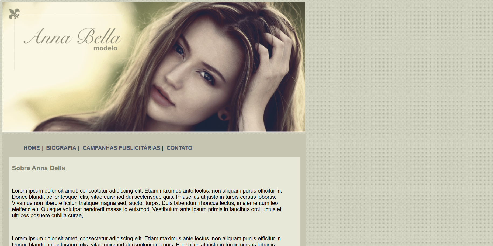

# Projeto Anna Bella



Bem-vindo ao repositório do **Projeto Anna Bella**!

## Sobre o Projeto

O Projeto Anna Bella é um site portfólio desenvolvido para apresentar o trabalho, a carreira e os contatos profissionais da modelo Anna Bella. O objetivo é criar uma presença digital elegante, responsiva e de fácil navegação, destacando fotos, biografia, depoimentos e formas de contato.

## Funcionalidades

- **Página inicial** com apresentação e destaque visual
- **Galeria de fotos** com imagens profissionais
- **Biografia detalhada** da modelo
- **Seção de depoimentos** de clientes e parceiros
- **Formulário de contato** para propostas e networking
- **Design responsivo** para dispositivos móveis e desktops

## Estrutura de Pastas

```
Projeto Anna Bella/
│
├── css/
│   └── style.css
│   └── image/
│       └── image.png
├── index.html
├── README.md
└── ...
```

## Tecnologias Utilizadas

- **HTML5** – Estrutura das páginas
- **CSS3** – Estilização e responsividade
- **JavaScript** – Funcionalidades interativas (opcional)
- **Imagens otimizadas** para web

## Instalação e Uso

1. **Clone o repositório:**
    ```bash
    git clone https://github.com/jusimargv/projeto-anna-bella.git
    ```
2. **Acesse a pasta do projeto:**
    ```bash
    cd projeto-anna-bella
    ```
3. **Abra o arquivo `index.html`** no seu navegador preferido.

## Como Contribuir

1. Faça um fork deste repositório.
2. Crie uma branch para sua feature ou correção:  
   `git checkout -b minha-feature`
3. Faça commit das suas alterações:  
   `git commit -m 'Minha nova feature'`
4. Faça push para a branch:  
   `git push origin minha-feature`
5. Abra um Pull Request.

## Licença

Este projeto está licenciado sob a [MIT License](LICENSE).

## Contato

- **Desenvolvedor:** Jusimar G. V.
- **E-mail:** jusimargv@gmail.com
- **LinkedIn:** [Seu Perfil](https://www.linkedin.com/in/jusimar-alves)

---

> _Sinta-se à vontade para contribuir e fazer parte deste projeto!_
